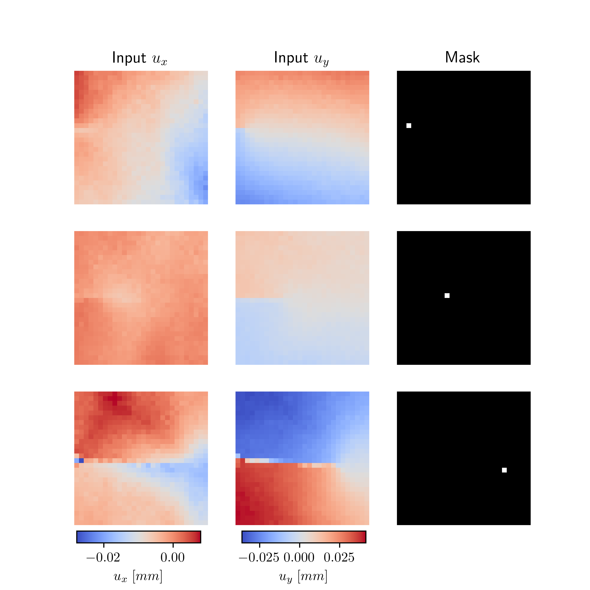

# CrackMNIST - Annotated Digital Image Correlation Displacement Fields from Fatigue Crack Growth Experiments
[](https://doi.org/10.5281/zenodo.15013128)
[](https://doi.org/10.5281/zenodo.15013922)
[](https://opensource.org/licenses/MIT)

## Introduction

Fatigue crack growth (FCG) experiments play a crucial role in materials science and engineering, 
particularly for the safe design of structures and components. However, conventional FCG 
experiments are both time-consuming and costly, relying primarily on integral measurement 
techniques such as the potential drop method to determine crack length.

Digital Image Correlation (DIC) is a non-contact optical technique that enables full-field 
displacement measurements during experiments. Accurately identifying crack tip positions from 
DIC data is essential but challenging due to inherent noise and artifacts.

Recently, a deep learning-based approach was introduced to automatically detect crack tip 
positions [1,2]. This method involved manually annotating a single experiment to train a 
convolutional neural network (CNN). Furthermore, an iterative crack tip correction technique 
was later developed to enhance detection accuracy [3]. However, this method is not fully 
automated and requires more time than applying a pre-trained CNN. With the rise of self-driven 
laboratories generating vast amounts of DIC data [4,5], reliable crack tip detection is essential 
for efficient and rapid data evaluation.

**References:**

1. **Strohmann T et al. (2021)** Automatic detection of fatigue crack paths using digital image correlation and 
   convolutional neural networks.
   _Fatigue and Fracture of Engineering Materials and Structures 44: 1336-1348_
   [https://doi.org/10.1111/ffe.13433](https://doi.org/10.1111/ffe.13433)
2. **Melching D et al. (2022)** Explainable machine learning for precise faticue crack tip detection. 
   _Scientific Reports 12, 9513_ 
   [https://doi.org/10.1038/s41598-022-13275-1](https://doi.org/10.1038/s41598-022-13275-1)
3. **Melching D et al. (2024)** An iterative crack tip correction algorithm discovered by physical deep symbolic regression.
    _International Journal of Fatigue, 187, 108432_
    [https://doi.org/10.1016/j.ijfatigue.2024.108432](https://doi.org/10.1016/j.ijfatigue.2024.108432)
4. **Paysan F et al. (2023)** A Robot-Assisted Microscopy System for Digital Image Correlation in Fatigue Crack Growth Testing.
    _Experimental Mechanics, 63, 975-986_
    [https://doi.org/10.1007/s11340-023-00964-9](https://doi.org/10.1007/s11340-023-00964-9)
5. **Strohmann T et al. (2024)** Next generation fatigue crack growth experiments of aerospace materials.
    _Scientific Reports 14, 14075_
    [https://doi.org/10.1038/s41598-024-63915-x](https://doi.org/10.1038/s41598-024-63915-x) 


## Objective
The objective of this project is to create a diverse, large-scale, and standardized dataset designed for the training 
and evaluation of deep learning-based crack tip detection and stress intensity factor (SIF) prediction methods. 
In addition to supporting research and practical applications, the dataset aims to serve an educational purpose by 
providing a high-quality resource for students and researchers in the field of material science and mechanics.

### DIC data
The dataset contains DIC data in the form of planar displacement fields ($u_x, u_y$) both measured in $mm$ 
from eight FCG experiments performed on different materials and specimen geometries. 
The tested materials (AA2024, AA7475 and AA7010) are aluminum alloys with an average Young's modulus (E) 
of approximately 70 GPa and a Poisson’s ratio (ν) of 0.33. 
For details, please refer to the corresponding data sheets.

The applied maximum nominal uniform stress for MT-Specimen is  σ<sub>N</sub> is 47 MPa (sinusoidal loading, constant amplitude). 
The minimum load can be derived from R=F<sub>min</sub>/F<sub>max</sub>. 
The expected Stress Intensity Factors K<sub>I</sub> vary approximately between 1 and 40 MPa√m. 

| Experiment       |      Material      | Specimen Type | Thickness [mm] | Orientation |  R  |
|------------------|:------------------:|:-------------:|:--------------:|:-----------:|:---:|
| MT160_2024_LT_1  | AA2024<sup>r</sup> |     MT160     |       2        |     LT      | 0.1 |
| MT160_2024_LT_2  | AA2024<sup>r</sup> |     MT160     |       2        |     LT      | 0.3 |
| MT160_2024_LT_3  | AA2024<sup>r</sup> |     MT160     |       2        |     LT      | 0.5 |
| MT160_2024_TL_1  | AA2024<sup>r</sup> |     MT160     |       2        |     TL      | 0.1 |
| MT160_2024_TL_2  | AA2024<sup>r</sup> |     MT160     |       2        |     TL      | 0.3 |
| MT160_7475_LT_1  | AA7475<sup>r</sup> |     MT160     |       4        |     LT      | 0.1 |
| MT160_7475_TL_1  | AA7475<sup>r</sup> |     MT160     |       4        |     TL      | 0.3 |
| CT75_7010_SL45_1 | AA7010<sup>f</sup> |     CT75      |       12       |    SL45°    | 0.1 |

---
<sup>r</sup> Rolled Material
<sup>f</sup> Forged Material

### Data annotation
Crack tip positions in the DIC data are annotated with the high-fidelity crack tip correction method 
from [3] (see Figure below).


The crack tip positions are stored as binary segmentation masks such that the labelled datasets
can directly be used for training semantic segmentation models.

### Stress Intensity Factors (SIFs)
In addition to crack tip segmentation masks, the dataset includes corresponding stress intensity factors (SIFs) 
for each sample. The SIFs consist of three components:
- **K<sub>I</sub>**: Mode I stress intensity factor (opening mode)
- **K<sub>II</sub>**: Mode II stress intensity factor (shear mode)  
- **T**: T-stress (non-singular stress component)

All SIF values are provided in units of MPa√m for K<sub>I</sub> and K<sub>II</sub>, and MPa for T-stress.
These values enable the dataset to be used for regression tasks, allowing neural networks to predict 
fracture mechanics parameters directly from displacement fields.

### Labelled datasets
We provide three datasets of different sizes ("S", "M", "L"). 
The datasets are split into training, validation, and test sets.
The following table shows the number of samples in each dataset.

| Dataset | Training | Validation | Test  |
|---------|----------|------------|-------|
| S       | 10048    | 5944       | 5944  |
| M       | 21640    | 11736      | 11672 |
| L       | 42056    | 11736      | 16560 |

The datasets are provided in three different pixel resolutions ($28 \times 28$, $64 \times 64$, 
$128 \times 128$) and stored in HDF5 format.

An overview which experiment is included in which dataset for training, validation and testing
can be found in the file `size_splits.json`.

### Visualization of labelled data samples
The following figure shows examples of labelled data samples from the CrackMNIST dataset.



The inputs consist of the planar displacement fields ($u_x, u_y$), and the outputs are the binary 
segmentation masks.

### Visualization of different pixel resolutions
The figure below shows the y-displacement field of a DIC sample at different pixel resolutions.


## Usage

### Installation

The package can be installed via pip:
```bash
pip install crackmnist
```
Datasets are uploaded to Zenodo and are downloaded automatically upon usage.

### Getting started
The datasets can be loaded using the implemented class CrackMNIST as follows
```python
from crackmnist import CrackMNIST

# Load dataset for crack tip segmentation
ct_dataset = CrackMNIST(split="train", pixels=28, size="S", task="crack_tip_segmentation")

# Load dataset for SIF regression
sif_dataset = CrackMNIST(split="train", pixels=28, size="S", task="SIF_regression")
```
Here, the parameters `split`, `pixels`, `size`, and `task` specify the dataset split, 
pixel resolution, dataset size, and task type, respectively.

Available tasks:
- `"crack_tip_segmentation"`: Binary segmentation masks for crack tip location (default)
- `"SIF_regression"`: Stress intensity factors (K<sub>I</sub>, K<sub>II</sub>, T-stress) as regression targets

The folder `examples` contains Jupyter notebooks:
- `getting_started.ipynb`: Demonstrates the dataset structure and visualization of both crack tip masks and SIF values
- `plot_samples.ipynb`: Additional examples for visualizing dataset samples


## Contributors

Code implementation and data annotation by:
- Erik Schultheis
- Ferdinand Dömling
- David Melching

Experiment conduction and DIC data acquisition by:
- Florian Paysan
- Ferdinand Dömling
- Eric Dietrich

Supervision and conceptualization by:
- [David Melching](mailto:David.Melching@dlr.de)
- [Eric Breitbarth](mailto:Eric.Breitbarth@dlr.de)


## Citation
If you use the dataset or code in your research, please cite this GitHub repository:

```bibtex
@misc{crackmnist,
  title={CrackMNIST - Annotated Digital Image Correlation Displacement Fields from Fatigue Crack Growth Experiments},
  author={David Melching and Ferdinand Dömling and Florian Paysan and Erik Schultheis and Eric Dietrich and Eric Breitbarth},
  journal={GitHub repository},
  howpublished={\url{https://www.github.com/dlr-wf/crackmnist}},
  year={2026},
  note={Version 2.0.0}
}
```

## License and Limitations
The package is developed for research and educational purposes only and must not be used 
for any production or specification purposes. We do not guarantee in any form 
for its flawless implementation and execution. However, if you run into errors in the code or 
find any bugs, feel free to contact us.

The code is licensed under MIT License (see LICENSE file).
The datasets are licensed under Creative Commons Attribution 4.0 International License (CC BY 4.0).